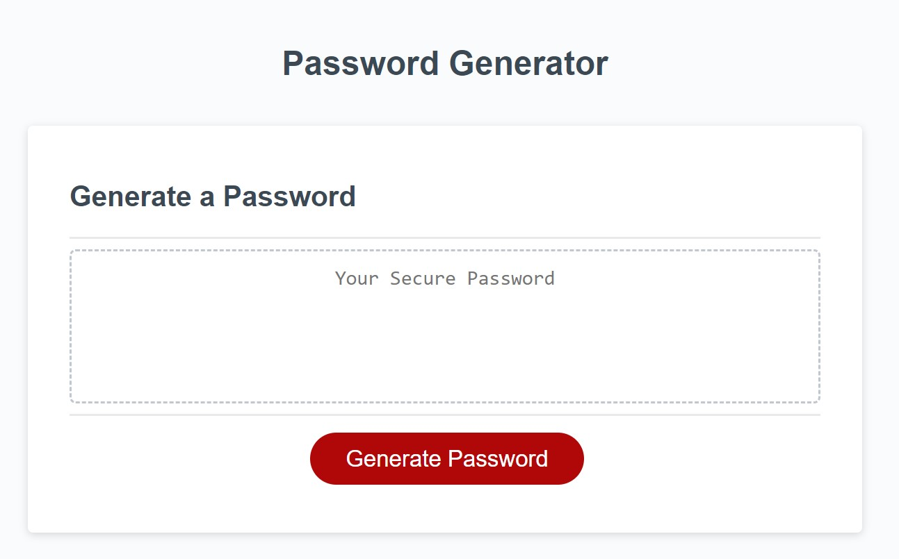

# JS-password-generator

## Description

This application was created to generate random passwords with the intended purpose of assisting to improve one's cyber security through password diversity. One may choose the length of their password through a prompt and whether numbers, letters, or characters are included through a confirmation box on the screen.

## Installation

Project is installed through a web browser. It is user-friendly and ready-to-use. Just access the browser through its URL:

https://maddieeckstrom.github.io/JS-password-generator/ 

## Usage

To generate a password, click the "Generate Password" button to recieve a series of questions. Answer the questions to your preference, and a random password will be generated while taking your preferences into account.

Screenshot of deployed application may be found at: 

## Credits

I collaborated with:

I used the following tutorials:

## License

MIT license
